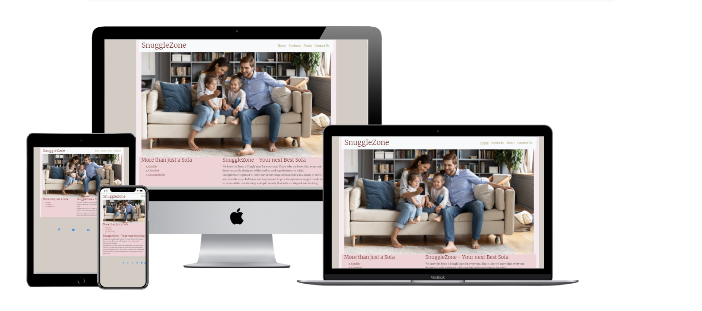
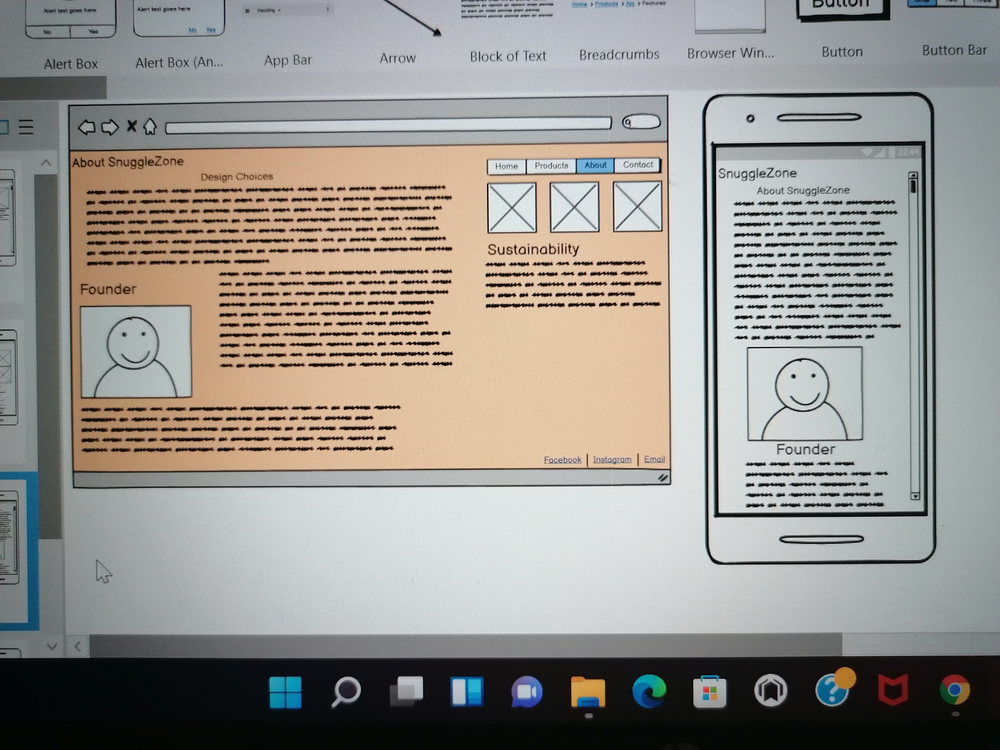

# Welcome to my first User Centric Frontend Development Project

For my Milestone Project 1 on Code Institute's Diploma in Software Developement course I have created a website for a sofa company. SnuggleZone is a company which specialises in making chic and comfortable sofas.

My website is effective and attractive on each device as my mockup images clearly display.

My GitPages website address is [https://kathbruten.github.io/Project-1/](https://kathbruten.github.io/Project-1/)

## Project Goals

### Who is this website for?
SnuggleZone aims to target individuals who are ready to invest in their home with a chic, elegant but simple sofa. I have therefore aimed to create a website which runs smoothly and is visually appealing but simple. 

### What does this website do?
This website will advertise sofa products and enable customers to get in touch and request a fitting, after which they will be able to purchase a product.

### User Stories
The customer base that I will aim to attract with to this website are:
* UK based, as this is the first website for a small company.
* Families
* First time Buyers
* Individuals who are loooking to invest in their home 
* They want to buy a product that is made well and will last 
* They want to buy a product from a company that is sustainable and cares about running an ethical business

## Developer and business goals
Designer goals are to create a website which runs smoothly, is efficient, visually appealling and helpful
Business goals are to create a user experience which will deliver the company's brand of luxurious and beautiful bespoke tables that are enjoyable, durable, practical and beautiful.

## The Five Planes
### Strategy Plane
This website was created to advertise and sell sofas, serving as a medium to view the sofas and gain insight into the business practices of the fictional brand, SnuggleZone. It is important that each page is simple, clear and effective to match the simple design of the brand. 

### Scope Plane 
The following features are included in my Project
4 different pages
Home page with hero image
Smooth and clear navigation

### Structure Plane

The website consists of 4 pages, which each have a specific purpose and flow together to create a logical and user friendly experience on the website. 
I created the following drafts for each page using Balsamiq Wireframes:

 

##### Navigation and Footer

Throughout all of my pages, the navigation and footer are the same throughout the website, which provide a constant throughout the user’s experience, and which are essential to enable the user to navigate around the website. On larger screens, the navigation is formatted as a bar across the screen with each page clearly selected. On smaller screens, the navigation is formatted as a dropdown bar with a button to keep the screen neat and clear for users. On all sizes, the active page is underlined in order to clearly notify the user of where in the site they currently are. 
The footer is formatted to scale down relatively, and always remains on one row to neatly fit the bottom of the screen. 

##### Home Page
 I wanted this page to be a simple insight into the company and an effective starting point for the 
 navigating around the website and browsing products / the company's techniques and ethos. I deliberately included a large photo of a family on a large sofa at the top of the page, because I wanted to make the purpose of this website clear to users as soon as they enter the website.

##### Products Page
I used three cards on this page to clearly display the 3 products that SnuggleZone has to offer. They were structured with a large enticing photo at the top, followed by a title, some description, then the size and price of each item. 

##### About Page
This Page is the most personal of all my pages, as it provides a more intimate insight into the company. I have included a nice introduction to the founders in the top left corner, and a large sustainability section below with 3 cards displaying the company's commitments to sustainability within the company. The largest section of this page is the Design Choices, which offers some more information on the decisions that were made in the design of each product and also some further shipping information.

##### Request a fitting
For this page, I made sure it was fuss-free and efficient, as this is the page where the customer does the talking. I added required Name and Email fields and also a larget field where the customer is asked to describe the product that they would like fitted. 

### Skeleton Plane
My website focused on a mobile first experience, where I designed all of my elements to stack neatly on top of each other to maintain ease of viewing and also provide a satisfying scrolling experience for the customer. However, I ensured that my website would create a positive user experience on all devices.

### Surface Plane
Colors
The color of the body of my website is #5b0f0b. I selected this because it would provide a warm background for my website, and suggest the pleasant experience that I want users to have on this website and with the products on offer.

For the container, I used rgb(245, 234, 238)which is a very light and soft pink, and which offset the sandy background in a way which is pleasing to the eye. 

For titles and bold text throughout my website, I used #5b0f0b. I also used this color to indicate when an element is hovered over. For all other fonts I used #605f43, which is a subtle color but can be clearly read against my background colors. 

#### Typography
Throughout the website, two fonts have been used
Merriweather for Headings
Playfair Display for paragraph text
These were chosen because they are both very clear and I hadn't seen them used in many well trafficked websites or on other forms of media, so I thought this would add the feeling of this fictional company being a real one, with a brand, logo and recognisable font.

#### Features 
Existing Features
Created in HTML5, CSS3 and Bootstrap
4 different pages and a downloadable PDF file
Cards on products and about page
Contact form to request fittings

### Features for future implementation
Purchasing and payment capabilities within website;
Ensure forms are fully functioning, with ability to store and action upon inputted data;
Cookie pop up banner

### Technologies Used
* [HTML5](https://en.wikipedia.org/wiki/HTML) for markup
* [CSS3](https://en.wikipedia.org/wiki/CSS) for style
* [GoogleFonts](https://fonts.google.com/) for fonts
* [Bootstrap](https://getbootstrap.com/) for main frame of the website
* [FontAwesome](https://fontawesome.com/) for icons
* [Git](https://git-scm.com/) for version control
* [GitHub](https://github.com/) for keeping the files, documents and deployment of the website

### Resources
* [pixbay](https://pixabay.com/) for royalty free images
* [CodeInstitute](https://codeinstitute.net/) for course materials
* [CodeInstitute](https://codeinstitute.net/) SlackCommunity 
* My Code Institute mentor for guidance
* [Bootstrap](https://getbootstrap.com/) for Card features and NavBar basecode
* [W3Schools](https://www.w3schools.com/) for help when I was stuck with a problem 
* [Sofology](https://www.sofology.co.uk/) for foctional product dimensions

### Testing 
Browser Testing 
I have tested this website on Chrome, Microsoft Explorer, Safari and on Mobile and tablet devices. On each of these the website if effective and provides a pleasant user experience.

### Validators 
The website has been tested on the W3C Jigsaw Validation, which shows that the website does not have any errors. 

Local Testing of all the buttons, links and functionality of the website has been carried out. The navigation button was not completely functional on all site pages when scaled down to a small screen, but this was resolved by editing the HTML on each page. 

### Responsiveness 
I used Google Chrome Dev Tools to inspect the website and check its responsiveness throughout the creation process. Mobile, tablet and desktop screens are all able to enjoy a clear and effective working website. I set 2 media queries within my code and have observed that these media query commands are all executed. 

### Challenges When Completing my Project
One challenge that I faced in my coding was making the cards on my About Page responsive (three-images-section). Initially, I had structured these as 3 image elements with 3 paragraph elements alongside. This became very confusing and simply didn’t work when scaled down. I then structured this section as 3 rows, each with an image and paragraph which I then formatted as ‘display:inline-block’ and included a media query of ‘vertical align: middle’ for smaller screens, but this was also ineffective. After these, and with the help of a consultation with my mentor, I structured this section with 3 cards containing captions, and made the background of each card transparent with no borders. 

### Git & GitHub
I used GitPod as a local repository and IDE and GitHub as a remote repository. The process of version control was:
First i created a new repository on GitHub.
I set up a GitHub for this repository.
In GitPod i have created all of my ideas for this project and the pages.
I was then saving my work and pushing it to GitHub repository to keep it safe.
I have included my process for saving, commiting and pushing my work below. This process was completed throughout my execusion of the project and was done in the terminal:
git add . for adding work to git
git commit -m "Commit message" to commit the work on the stage
git push to update work to GitHub

### Deployment
To deploy the website, I followed the below steps on GitHub.
Go to "Settings" on the repository
On "Source" of "GitHub Pages", select "master for Branch and click save
The website is now published on GitHub Pages and the link is provided on on the same section
